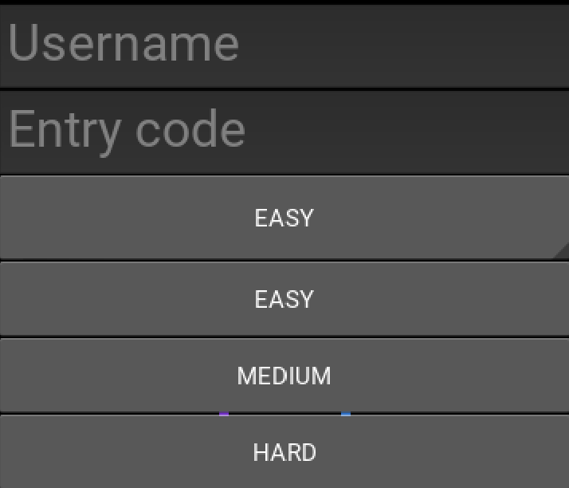
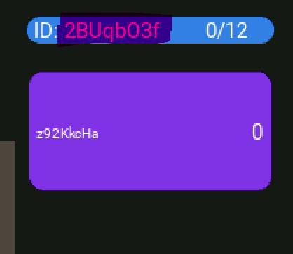
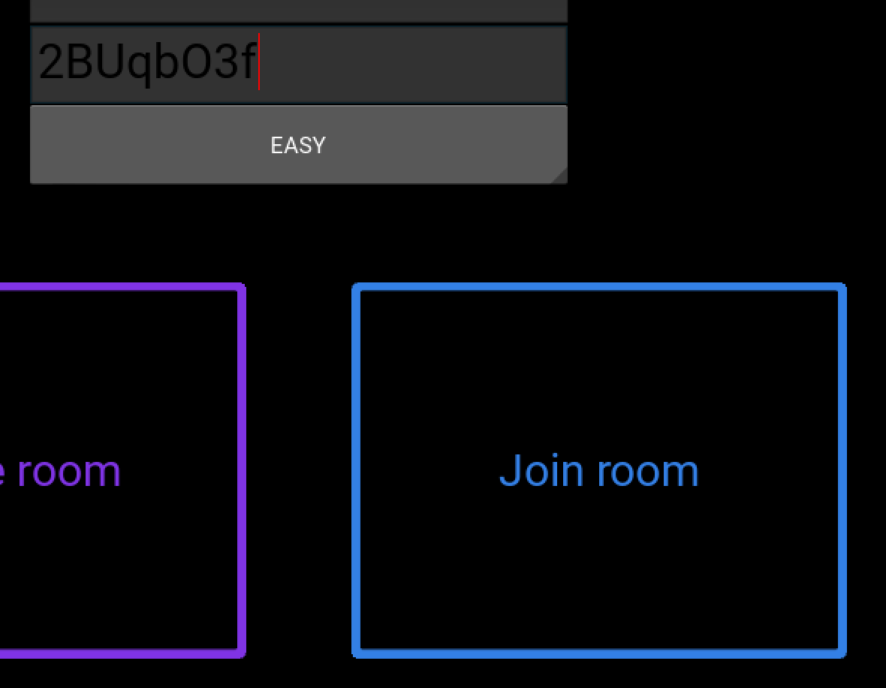
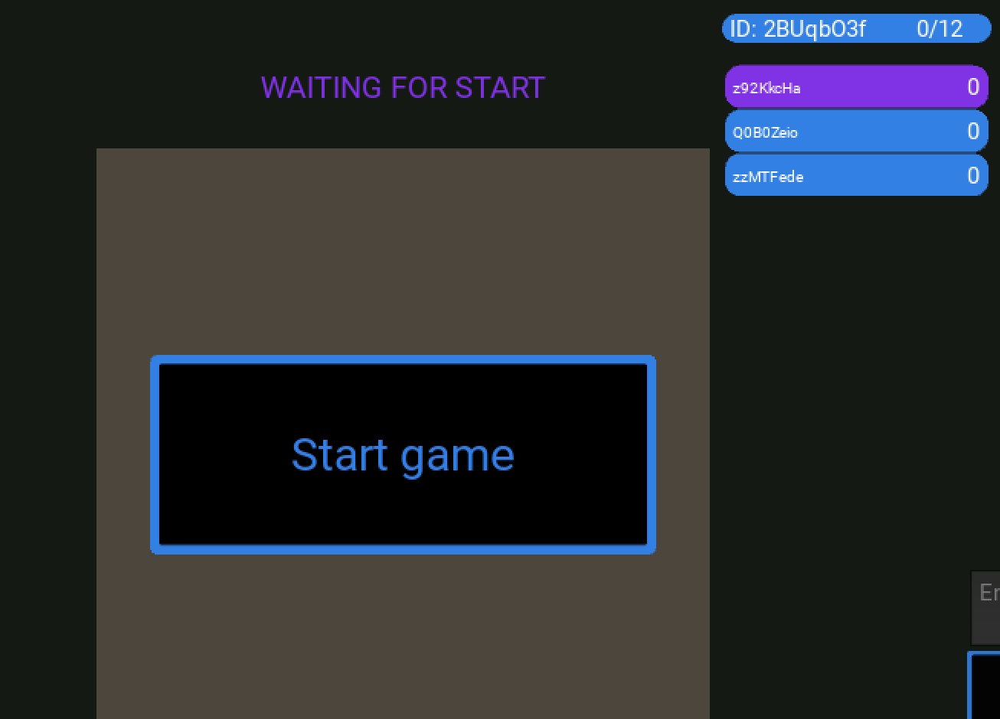
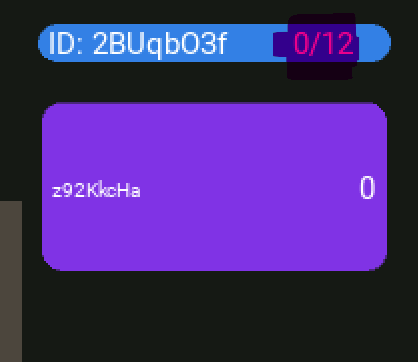
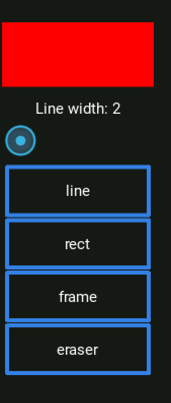
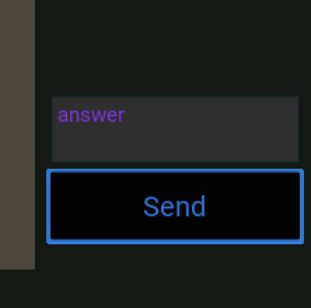
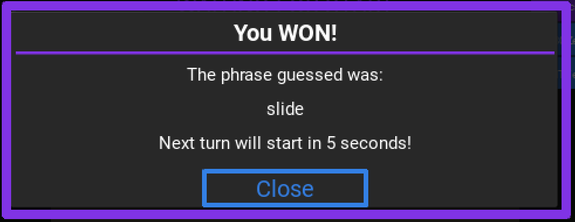
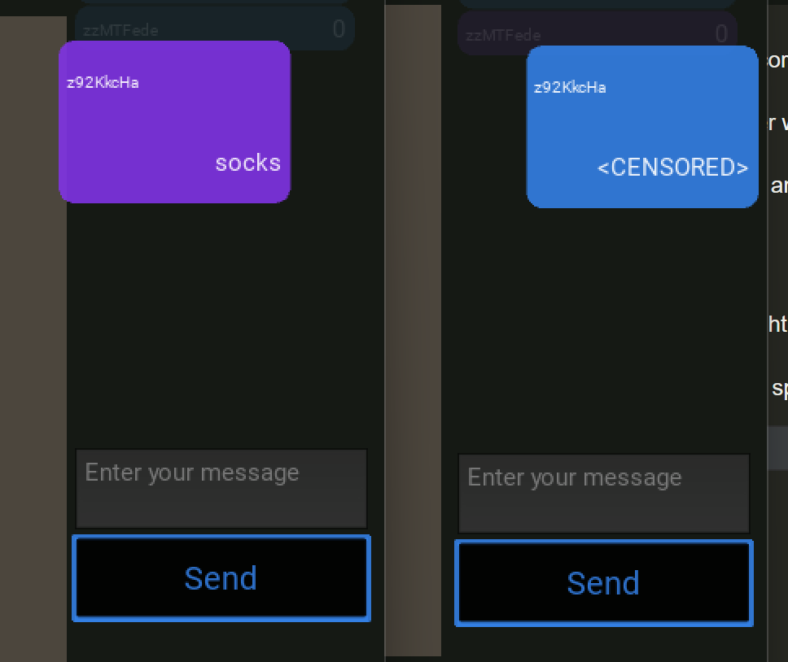
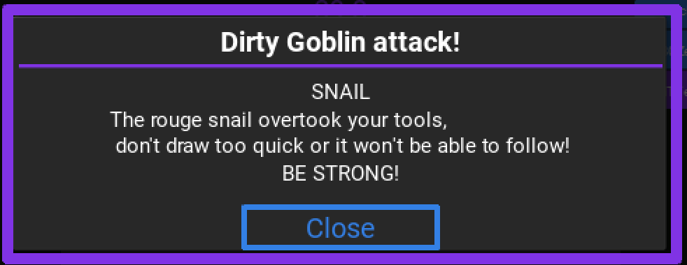

[](https://www.pythondiscord.com/static/images/events/summer_code_jam_2022/site_banner.png)

# Drawn (by Cerabral Centaurs)

## Introduction

What if you want to play something fun with your friends, but you are so fed up with all the popular games?

That means you haven't seen __Drawn__ by __Cerebral Centaurs__ yet!

Based on old school Pictionary game, with additional surprises waiting for the drawer each turn.

## About the game

### Game creation

#### Difficulty level

__Drawn__ has three difficulty levels that will challenge even veterans (select from Easy/ Medium/ Hard during game creation).

[](static_files/difficulty.png)

#### Room creation

To join the room you will need an entry code provided by the game creator, or you can start a game of your own and invite your friends.

You can click game ID/ Code to copy it and pass to other players.

[](static_files/game_id.png)

To join the game enter the code in the field and hit `join game`.

[](static_files/join_game.png)

To start the game you need at least three players.

[](static_files/start_game.png)

You can choose your username as long as it's unique.
Alternatively, you can go with the random one prepared by us (leave username field empty).

#### Game duration

The game has a random amount of turns, between 3 and 15. In the picture below it's 12 turns.

[](static_files/turns.png)

The turn duration is picked at random too. It might be either 30 or 60 seconds.

## Gameplay

### General

#### Drawing

As a drawer, each turn you must draw a word displayed on your screen so others can guess it.

##### Drawing tools

You have 4 tools available to draw:
- free-hand line
- rectangle (filled)
- frame (not filled)
- eraser

You can also randomly pick a color by clicking on color picker as well as increase/decrease the line width.

[](static_files/tools.png)

#### Guessing

Other players can guess the phrase by typing the message in the chat.

[](static_files/chat.png)

The first person typing the correct word(s) wins.

[](static_files/win.png)

The winner will be the player who correctly guesses most of the words.

The drawer cannot post the answer in the chat, it will be censored for other players.

[](static_files/censor.png)


### *It's not a bug, it's a feature.*

We approached the code jam theme by implementing intentional bugs into our application, that along the way were transformed into mischievous goblin attacks.

Therefore, during each turn, with a slight delay, you are more than sure to be attacked by Dirty Goblin that surely doesn't want to help you!

[](static_files/goblin.png)

There are four tricks he can spawn on your canvas.
- You got __Earthquake__? Don't worry! It's just your canvas that is moving. Your drawings might be a little more inaccurate, but trust me, they will become a piece of art!
- Did your canvas jump through the whole screen? That must be __Landslide__. Keep in mind that others still see the picture in its starting position. So bow your head and keep drawing!
- I hope you have a lot of patience. You will need all of it to fight __Pacman__. He forgot to eat breakfast and now he feels like eating your drawing. Keep restoring your picture, otherwise, you will be in huge trouble
- If you want to slow down a bit __Snail__ will be perfect for you. Draw too fast and it will struggle to keep up and start taking shortcuts making your drawing angular - almost impossible to recognize
- Sometimes, you will be able to draw peacefully. Even our Dirty Goblin needs to take a rest from his little tricks. Don't worry! He will be back sooner than you think ;)

## Dependencies

To run the project you need `python 3.10.*` installed.

For dependency management and virtualenv creation `poetry` needs to be installed.

The project client was build with:
- `kivy`
- `websockets`

The server is based on:
- `FastAPI`
- `pydantic`
- `uvicorn`

## Launching the game

### Install dependencies

Navigate to the project root and run the following command.

This will install all required dependencies in a new env.

```bash
poetry install
```

### Server

Run the `FastAPI` server through `uvicorn`.

Add `--reload` flag if you want to reload the server on file changes.

By default, server starts at http://127.0.0.1:8000

```bash
poetry run uvicorn codejam.server:app --reload
```

If you edit the server config please update the url in the client.
See the section Hosted server below.

### Clients
Start the clients in separate windows.

Remember that you need at least 3 players to start the game, so when running at local you need to start 3 separate clients.

One of the clients needs to start the game and share the game id that other clients use as code to join the game.

For details see section gameplay above.

```bash
poetry run python codejam/client/client.py
```

**Note that one of the tricky things we left in the game are client sizes. If each client window has a different size, each player will see a different portion of each other's canvas, so you can draw outside the view of other players! ;)**

## Android Application

The game is also available as an .apk file to install on your android device.

The application is available here: <a id="raw-url" href="static_files/drawn-0.1.apk">Download APK</a>
(alternatively you can download it from `static_files` folder in this github repo)

## Hosted server

The application is also hosted on heroku as a demo: `ws://cerebral-centaurs.herokuapp.com/ws/`

The android client connects to this instance.

You can use it for tests too if you want to play with your friends over the internet.

You need to modify the url attribute in

```python
# file codejam/client/widgets/whiteboard_screen.py
class WhiteBoardScreen(EventHandler):
    """WhiteBoardScreen"""

    def __init__(self, **kwargs):
        super().__init__(**kwargs)
        self.url = "ws://127.0.0.1:8000/ws/{0}" # <= edit here

```

## Project Setup (development)

1. Install python 3.10.X: [Download](https://www.python.org/downloads/)
2. Install poetry (note that poetry is installed globally) [Installation](https://python-poetry.org/docs/#installation)
3. Navigate to your project folder and initialize virtual environment
```bash
poetry env use path/to/your/python3.10/executable
```
4. Install dependencies
```bash
poetry install
```
5. Install `pre-commit` hooks (will be cached)
```bash
poetry run pre-commit install
```
6. Create a new feature branch
```bash
git checkout -b my_feature_name
```
7. Add your code, push and create a PR (github) - that will trigger tests and pre-commit hooks. **Note that working directly on main branch is prohibited!**
8. If you edit pyproject.toml remember to run poetry lock command!
```bash
poetry lock
```
10. Manually running pre-commit hooks:
```
poetry run pre-commit run --all-files
```

9. For local unit testing, please use `pytest`:
```
poetry run pytest tests --cov=codejam --cov=tests --cov-report=term-missing
```

## Project development history visualised


